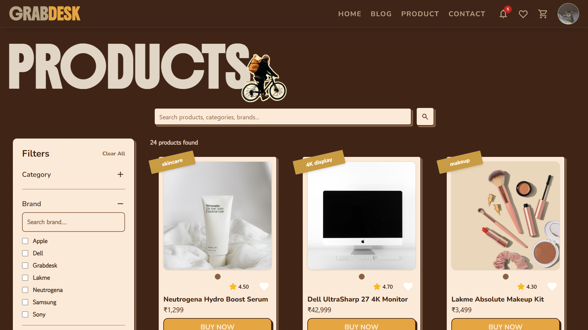
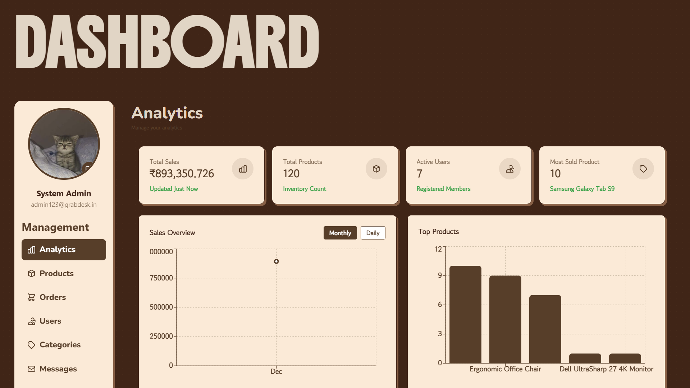

# 🛒 GrabDesk – Your Personalized Fashion Destination


**GrabDesk** is a modern, full-stack e-commerce platform built using the **MERN (MongoDB, Express, React, Node.js)** stack. It's designed to provide a premium, editorial shopping experience with a focus on personalized product recommendations and an intuitive admin management system.

---

## ✨ Key Features

### 🛍️ For Shoppers
- **Personalized Discovery**: Smart recommendation engine that suggests products based on your browsing and purchase history.
- **Dynamic Search & Filters**: Highly responsive filtering system for category, price, and brand.
- **Seamless Checkout**: A streamlined multi-step checkout process with cart persistence.
- **Wishlist & History**: Save your favorites and track your previous orders with ease.
- **Premium UI**: Smooth animations, glassmorphism elements, and a clean editorial design.

### 🛡️ For Admins
- **Insightful Dashboard**: Real-time sales analytics and user activity visualization.
- **Catalog Management**: Full CRUD operations for products with bulk-upload capabilities.
- **Order Tracking**: Manage order statuses from pending to delivered in a single interface.
- **Activity Logs**: Stay updated on every significant system event through live notifications.

---

## 🖼️ Visual Previews

| Product Catalog | Admin Dashboard |
| :---: | :---: |
|  |  |

---

## 🛠️ Technology Stack

| Layer | Technologies |
| :--- | :--- |
| **Frontend** | React, Vite, Tailwind CSS, Framer Motion, Axios, Context API |
| **Backend** | Node.js, Express.js, Socket.IO (Real-time updates) |
| **Database** | MongoDB (Mongoose), Cloudinary (Image Hosting) |
| **Security** | JWT Authentication, Bcrypt (Password Hashing) |
| **Deployment** | Vercel (Frontend), Render (Backend), MongoDB Atlas |

---

## 📂 Architecture Overview

For a deep dive into how the system is built, please refer to our detailed documentation:

- 🏗️ **[Frontend Architecture](./Frontend_architecture.md)**: Details on component structure, state management, and design principles.
- ⚙️ **[Backend Architecture](./BACKEND_ARCHITECTURE.md)**: Deep dive into API endpoints, database schemas, and server-side logic.

---

## 🚀 Getting Started

### 1. Prerequisites
- Node.js (v16+)
- MongoDB Atlas account or local MongoDB instance
- Cloudinary Account (for image uploads)

### 2. Installation
```bash
# Clone the repository
git clone https://github.com/your-username/grabdesk.git
cd grabdesk

# Install dependencies for both client and server
npm install
cd client && npm install
cd ../server && npm install
```

### 3. Environment Setup
Create a `.env` file in the `/server` directory:
```env
MONGO_URI=your_mongodb_connection_string
JWT_SECRET=your_jwt_secret
CLOUDINARY_CLOUD_NAME=your_name
CLOUDINARY_API_KEY=your_key
CLOUDINARY_API_SECRET=your_secret
PORT=5000
```

### 4. Running the App
```bash
# Run server (from /server)
npm run server

# Run client (from /client)
npm run dev
```

---

## 🤝 Authors
- **Sagar, Harshit, Banisha**
- Project: GrabDesk - Personalized Online Shopping Platform.

---

## 📜 License
This project is licensed under the **MIT License**. Check the [LICENSE](./LICENSE) file for details.

